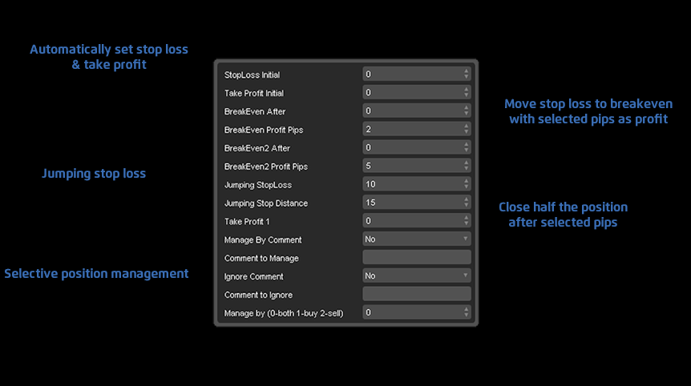

# cTrader Position Manager
Manages your open positions on the cTrader trading platform.

StopLoss Initial
Automatically sets the stop loss on positions that do not have one. Value is the amount of pips you are willing to risk.

TakeProfit Initial
Automatically sets the take profit on positions that do not have one. Value is the profit target in pips.

BreakEven After
Moves the stop-loss to "BreakEven Profit Pips" after selected amount of pips have been gained.

BreakEven Profit Pips
Profit that you would like to garantee after "BreakEven After" has been reached.

BreakEven2 After/Profit Pips
Same as above, but with a different target.

Jumping StopLoss
Set this value to the amount of pips that the stoploss should jump

Jumping Stop Distance
If "Jumping StopLoss" is used, this is the minimum distance between the current price and the new StopLoss that is to be set.

Take Profit 1
Close half the position after the selected amount of pips have been gained.

The Following settings are used to specify what kind of positions to manage or skip:

Manage This Pair Only
If yes, only manage pairs pertaining to the chart that the cBot is running on.

Manage By Comment / Comment To Manage
Only manage positions with comments that match what is typed here

Ignore Comment / Comment To Ignore
Do not manage positions with comments that match what is typed here.

Manage by 0-both, 1-buy, 2-sell
Select the type of positions to manage, 1-Short, 2-Long, or 0-Long&Short
